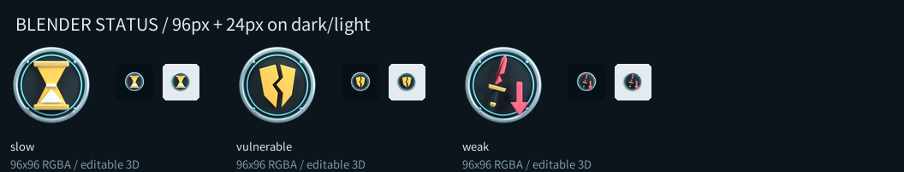
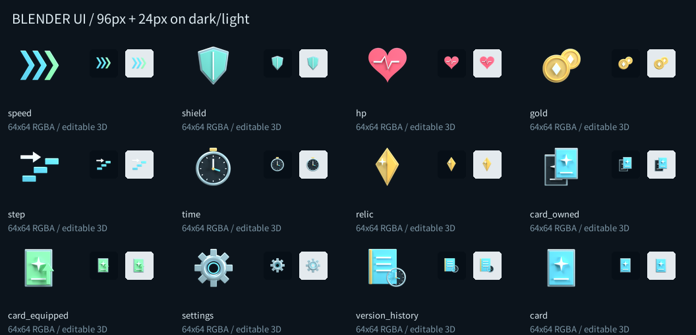
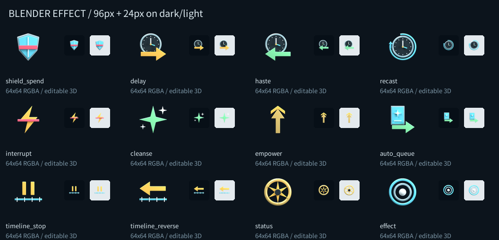
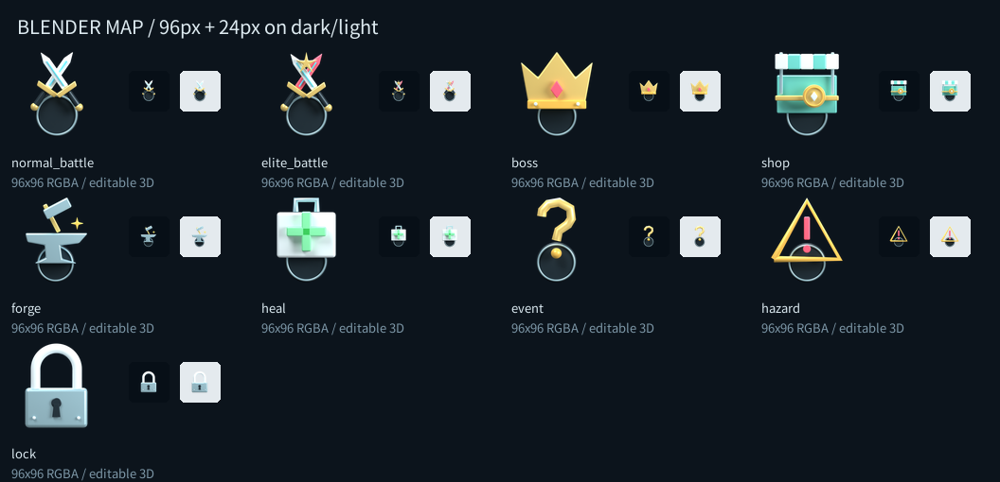
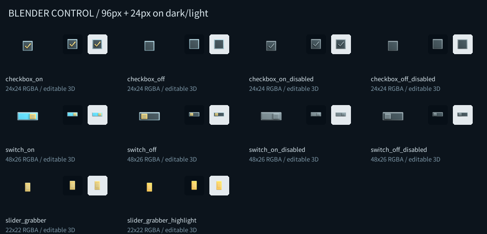

# Blender 小型アイコン・UIバッチ

制作・確認日: 2026-10-10

## 完成内容

既存の攻撃・出血アイコンと第一弾の画像を維持し、それ以外の小型アイコンを46点制作しました。Blender 5.2.2 LTSの編集可能なメッシュ・立体カーブから、正投影、透過、512pxでレンダーしています。画像テクスチャを板へ貼る方式ではありません。

| 区分 | 数 | ID / 内容 | ゲーム用サイズ |
| --- | ---: | --- | --- |
| 状態 | 3 | slow、vulnerable、weak | 96x96 RGBA |
| 共通UI | 12 | speed、shield、hp、gold、step、time、relic、card_owned、card_equipped、settings、version_history、card | 64x64 RGBA |
| カード効果 | 12 | shield_spend、delay、haste、recast、interrupt、cleanse、empower、auto_queue、timeline_stop、timeline_reverse、status、effect | 64x64 RGBA |
| マップ | 9 | normal_battle、elite_battle、boss、shop、forge、heal、event、hazard、lock | 96x96 RGBA |
| 操作部品 | 10 | チェック4状態、スイッチ4状態、スライダーつまみ2状態 | 24x24 / 48x26 / 22x22 RGBA |

状態は出血と同じ鋼色のリングに、砂時計・割れた盾・折れた剣と下向き矢印を入れています。共通UIはハート・貨幣・階段・時計などをシンプルな立体ピクトグラムにしています。マップの錠前には台座や背景を付けず、シャックルの内側も透過しています。

原本は46コレクション、209メッシュ、117立体カーブ、計326オブジェクト、10,576メッシュ頂点です。鋼、黒鉄、エナメル、真鍮、共通ベベル、リム、時計、盾、カードの部品を再利用しています。各コレクションはAsset Browserへ登録してあり、名前はマニフェストの`source_collection`と一致します。

## 原本と出力

- 編集原本: `art_src/blender/ui/qq_small_icons.blend`
- 集約マニフェスト: `art_src/blender/ui/qq_small_icons.manifest.json`
- 生成スクリプト: `tools/blender/build_ui_batch.py`
- 縮小・画像検証: `tools/finalize_ui_batch.py`
- 原本検証: `tools/blender/validate_ui_batch.py`
- 操作部品の状態アトラス: `art_src/blender/ui/control_states.atlas.png`
- 高解像度レンダー: `tools/.local/blender_ui_batch/`。中間ファイルなのでGit・PCK対象外です。
- ゲーム用PNG: `assets/icons/status/`、`ui/`、`effects/`、`map/`、`controls/`

46点のゲーム用PNGは合計251,123バイト、Blender原本は314,851バイトです。原本とアトラスは`art_src/.gdignore`配下にあり、Web PCKには入りません。ゲームは小さなPNGだけを読み込みます。

マニフェストには`batch_id`、Blender版、生成スクリプト・原本・出力のSHA-256、各IDの区分、表示用ID、出力先、寸法、再利用部品、24pxでの可視ピクセル数を記録しています。UIは`ui_`、効果は`effect_`、マップは`map_`、操作部品は`control_`をIDに付け、状態は既存のIDを維持しています。共有の`data/art_provenance.json`への集約は親作業が行います。

## ゲームへの接続

- `StatIconFactory`と状態表示は既存の画像読み込み経路を利用しています。
- `CardEffectIconFactory`は`assets/icons/effects/{id}.png`を優先し、未存在時だけ従来の描画へフォールバックします。
- `MapNodeButton`は通常ノードと錠前の画像を読み込み、既存のキャッシュを維持します。
- `UiTheme`は操作部品の画像を利用します。チェック・スイッチ・つまみのピクセル寸法、行のサイズ、ホバー時の枠、押下状態、無効状態を維持しています。
- 既存の初回キャッシュ処理で読み込まれるため、別の画面で同じ画像を繰り返し作り直しません。
- 操作アトラスは編集・確認用です。実行時は個別PNGを利用し、余分なAtlasTextureや矩形計算を追加していません。

## 確認画像

各画像には大きな表示と24px表示、暗い背景・明るい背景の比較を含めています。











## 検証結果

| 検証 | 結果 |
| --- | --- |
| 原本・生成コード・全出力のSHA-256、46点のIDと出力先の一意性、必要IDの完全性 | 合格 |
| 512px原画の端切れ、出力寸法、RGBA、透明な四隅、24pxのシルエット、錠前の穴 | 合格 |
| Blender原本46コレクション、メッシュ・カーブの立体厚み、画像貼り付け不使用 | 合格 |
| Godotインポート | スクリプトエラーなし |
| UiIconBatchSmoke | 全46画像の実ロード、各Factory、キャッシュ、操作状態、フォールバック合格 |
| SettingsSmoke | 合格。オン状態のホバー枠も維持 |
| MapFacilitySmoke | 合格 |
| CardLayoutSmoke | 合格。11サイズのカード表示・状態・マスク |
| StartupCacheSmoke | 合格。stat_icons=13、card_effect_icons=21、map_icons=9、status_icons=4 |
| Godot実描画 | OpenGL Compatibility / RTX 3060で全46点と操作部品を画面出力し確認 |

ブラウザ実機と公開Web配信の確認は、このバッチ単体では行っていません。共有のバージョン、起動処理、制作計画、ブランド・背景、来歴、Gitコミット・pushは変更していません。

## 再生成・手動確認

ライブBlender/MCPは使わず、毎回独立したバックグラウンドプロセスで生成します。

```powershell
powershell -ExecutionPolicy Bypass -File tools/build_blender_ui_batch.ps1
python tools/finalize_ui_batch.py --validate-only
& 'C:\Users\kazuu\Downloads\Godot_v4.6.2-stable_win64.exe\Godot_v4.6.2-stable_win64_console.exe' --headless --path . res://tools/UiIconBatchSmoke.tscn
& 'C:\Users\kazuu\Downloads\Godot_v4.6.2-stable_win64.exe\Godot_v4.6.2-stable_win64_console.exe' --path . res://tools/UiIconBatchReview.tscn
```

`UiIconBatchReview`は全画像とチェック・スイッチ・スライダーを並べる確認シーンです。親作業から開発者パネルへ接続できます。`-- --capture-ui-icons`を付けると、`tools/.local/ui_icon_batch_runtime.png`へ実画面を保存して終了します。
